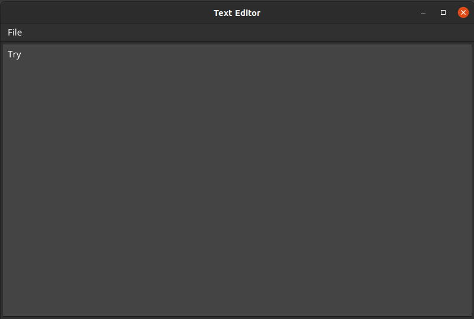

# Simple Text Editor

| Created using fyne

### This is really bad example of text editor. But it is just for learning.

### Functions:
* Open File
* Save File (Save As)
* Edit File
* Exit (with confirmation)

### Used sources for creating:
* Fyne doc: https://developer.fyne.io/index.html
* Go with examples: https://golangbyexample.com/

### Screenshot:

